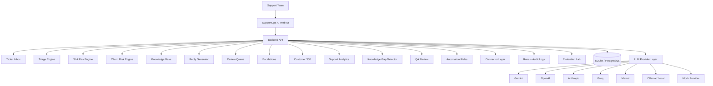
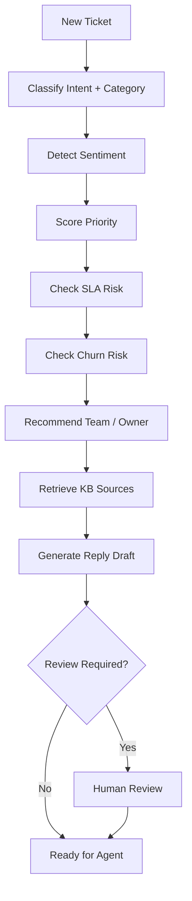
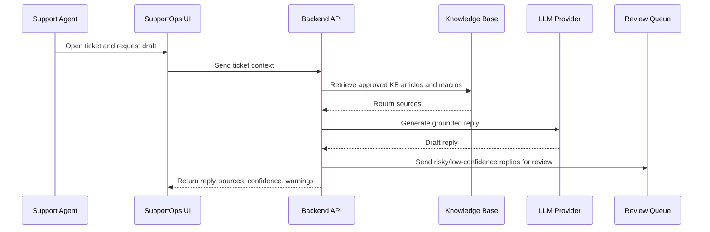
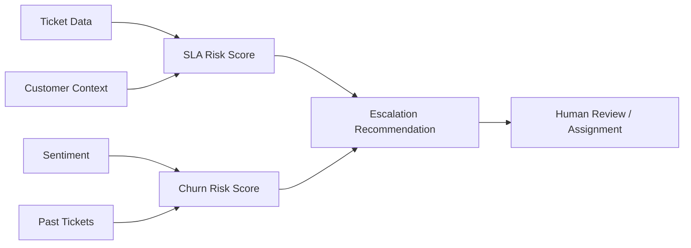
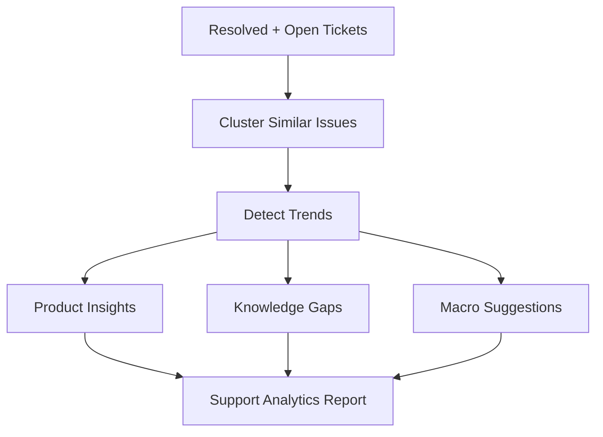
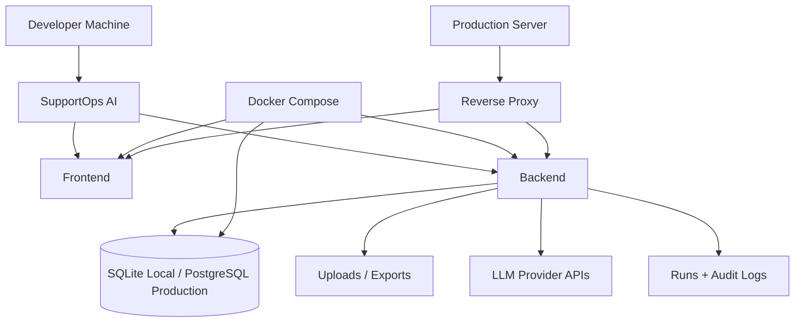

# SupportOps AI — AI Customer Support Operations Command Center

SupportOps AI is an AI-powered customer support operations command center. It helps SaaS companies, e-commerce teams, agencies, IT helpdesks, startups, and success teams triage tickets, classify issues, detect SLA/churn risk, generate knowledge-base-grounded replies, escalate urgent cases, analyze support trends, and audit reply quality.

The platform is designed to act as a **support team supervisor + AI triage agent + response assistant + support analyst** in a lightweight, local-first deployment.

---

## 📖 The Problem & Market Gap

Most modern support tools fall into two extremes: either they are massive, expensive helpdesk suites (like Zendesk or Intercom) that require complex migrations, or they are simplistic chat interfaces that hallucinate answers and lack operational security. 

SupportOps AI closes this gap by focusing on an **upload-first and local-first support intelligence workflow**:

1. **Lightweight bulk triage**: Instantly analyze exported CSV/JSON files or manual inputs without migrating active helpdesk databases.
2. **Evidence-grounded safety**: Every suggested reply shows exact supporting source snippets from policies or FAQs to prevent hallucinations.
3. **Refund & SLA risk gates**: System automatically flags payment mentions, prompt injections, and VIP escalation flags for human review.
4. **Knowledge-base improvement**: Identifies topics that lack documentation support and automatically drafts new articles to address them.

---

## 🧬 System Architecture

### 1. SupportOps AI Architecture



### 2. Ticket Triage Workflow



### 3. KB-Grounded Reply Workflow



### 4. SLA and Churn Risk Flow



### 5. Support Analytics Workflow



### 6. Deployment Blueprint



---

## ✨ Features

- **Triage command center**: Metric summaries of high-SLA risks, escalations, negative sentiment volumes, and grounding parameters.
- **Ticket Inbox**: Search, assign priority, edit replies, summaries long threads, and log audit comments.
- **SLA & Churn Risk Alerting**: Countdown tracking, VIP tier weights, and CS refund retention playbooks.
- **Knowledge Base Editor**: Add documentation, change statuses (`approved`, `draft`, `outdated`, `needs review`), and edit content.
- **Human Review Queue**: Send low-confidence or high-risk answers for validation before dispatch.
- **Evaluation Lab**: Run regression testing across models to evaluate classification accuracy.
- **Multi-Provider LLM Switcher**: Toggle between Gemini, OpenAI, Claude, Groq, Mistral, Ollama, and Mock providers.

---

## 📂 Repository Structure

```text
supportops-ai/
├── app.py                      # Core routing entrypoint
├── requirements.txt            # Python dependencies
├── .env.example                # Sample environment configurations
├── .gitignore                  # Ignored credentials and local databases
├── src/
│   ├── database.py             # SQLite DB manager and CRUD helpers
│   ├── ui_styles.py            # Clean, premium white SaaS theme styles
│   ├── llm.py                  # Multi-provider LLM adapter
│   ├── data_loader.py          # Refactored data normalizer
│   ├── analysis_engine.py      # Core analysis pipeline orchestrator
│   ├── retrieval.py            # Document tokenizer and Jaccard searcher
│   ├── rules.py                # Rule engines and SLA/churn heuristic logic
│   ├── exporter.py             # Export center logic
│   ├── seeds.py                # Populates local databases with mock data
│   ├── views/                  # UI view modules
│   │   ├── dashboard.py
│   │   ├── tickets.py
│   │   ├── sla_risk.py
│   │   ├── churn_risk.py
│   │   ├── knowledge_base.py
│   │   ├── macros.py
│   │   ├── reviews.py
│   │   ├── escalations.py
│   │   ├── customers.py
│   │   ├── analytics.py
│   │   ├── knowledge_gaps.py
│   │   ├── qa_review.py
│   │   ├── automation_rules.py
│   │   ├── connectors.py
│   │   ├── evals.py
│   │   ├── audit_logs.py
│   │   └── settings.py
├── tests/                      # Automated test suite
│   ├── test_triage.py
│   ├── test_database.py
│   └── test_providers.py
├── Dockerfile                  # Container configurations
└── docker-compose.yml          # Local container compose
```

---

## 🚀 Setup & Installation

### Local Installation

1. **Clone the repository**:
   ```bash
   git clone <REPO_URL>
   cd supportops-ai
   ```

2. **Configure environment**:
   ```bash
   cp .env.example .env
   ```

3. **Install dependencies**:
   ```bash
   pip install -r requirements.txt
   ```

4. **Initialize and Seed Database**:
   ```bash
   python src/seeds.py
   ```

5. **Launch App**:
   ```bash
   streamlit run app.py
   ```

### Running with Docker

1. **Build and start containers**:
   ```bash
   docker compose up --build
   ```

---

## 🛠️ Multi-Provider LLM Setup

To use paid model APIs, switch to your preferred provider in the **Settings** tab and input your API key:
- **Gemini**: Set `GEMINI_API_KEY`
- **OpenAI**: Set `OPENAI_API_KEY`
- **Claude**: Set `ANTHROPIC_API_KEY`
- **Groq**: Set `GROQ_API_KEY`
- **Mistral**: Set `MISTRAL_API_KEY`
- **Ollama**: Set `OLLAMA_BASE_URL` (defaults to `http://localhost:11434`)

If running without keys, the default **Mock Provider** handles generation by applying realistic grounding structures.

---

## 🧪 Testing

Run pytest to verify rule calculations, DB schemas, and mock adapters:
```bash
pytest
```

---

## 🔌 API Examples

SupportOps AI exposes modular APIs for third-party scripts.

### 1. Ingest Ticket via curl
```bash
curl -X POST http://localhost:8501/api/tickets \
  -H "Content-Type: application/json" \
  -d '{
    "ticket_id": "T-2001",
    "customer_name": "Marcus Aurelius",
    "email": "marcus@rome.gov",
    "subject": "Shipment damaged in Gaul",
    "body": "The olive oil amphoras arrived broken. Order SO-991.",
    "channel": "email"
  }'
```

### 2. Generate Reply using Python
```python
import requests

payload = {
    "ticket_id": "T-2001",
    "tone": "Professional",
    "grounding_kb": "KB-201"
}
response = requests.post("http://localhost:8501/api/tickets/T-2001/generate-reply", json=payload)
print(response.json()["suggested_reply"])
```

### 3. Fetch SLA Risks using JavaScript
```javascript
fetch('http://localhost:8501/api/analytics/sla')
  .then(res => res.json())
  .then(data => console.log(`High risk tickets: ${data.high_risk_count}`));
```

---

## 🔒 Security & Privacy Model

- **Local-first**: All database entries and audit packages are kept in a local SQLite file (`supportops.db`).
- **PII Sanitation**: Auto-redacts payment credentials, credentials leaks, and potential prompt injection scripts.
- **LLM warning notices**: Displays caution banners before transmitting customer strings to cloud APIs.

---

## 🗺️ Roadmap & Limitations

### Limitations
- Multi-user authentication is simulated locally (single workspace context).
- Auto-resolution routes are disabled by default (human-in-the-loop validation is required).

### Roadmap
- Integration with live OAuth mail services (Gmail, Outlook).
- Custom Vector DB mappings for high-scale document embeddings.
- Automatic CSAT surveys generation post resolution.

---

## 📄 License

Distributed under the MIT License. See `LICENSE` for details.
